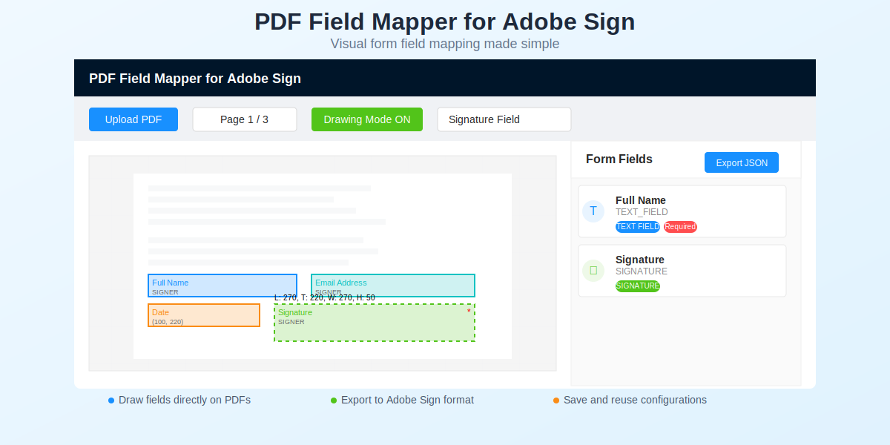

# PDF Field Mapper for Adobe Sign

A visual PDF field mapping tool that allows you to configure Adobe Sign form fields without leaving your application. This Angular-based solution demonstrates how to embed document preparation capabilities directly into your own applications, eliminating the need to switch to Adobe Sign's interface.



A visual PDF field mapping tool that allows you to configure Adobe Sign form fields without leaving your application...

## Overview

While Adobe Sign provides its own interface for adding form fields to documents, requiring users to leave your application disrupts workflows and creates training overhead. This project proves that field mapping can be seamlessly integrated into your existing applications using Adobe Sign's API.

### Key Features

- 📄 **Visual PDF rendering** with PDF.js
- ✏️ **Draw fields directly** on PDF documents
- 🎯 **Precise positioning** with coordinate grid overlay
- 📝 **Support for all Adobe Sign field types** (text, signature, date, checkbox, etc.)
- 👥 **Multi-recipient support** (Signer, Approver)
- 💾 **Import/Export field configurations** as JSON
- 🔄 **Adobe Sign API-compatible** export format
- 🎨 **Clean, modern UI** with Ant Design (ng-zorro)

## Use Cases

- **Enterprise Applications**: Embed document configuration directly in your business applications
- **Document Management Systems**: Add field mapping as a native feature
- **CRM Integration**: Configure contracts without leaving your CRM
- **Workflow Automation**: Programmatically generate field configurations

## Technical Stack

- **Angular 19**: Component-based architecture for easy integration
- **PDF.js**: Client-side PDF rendering
- **Ant Design (ng-zorro)**: Professional UI components
- **TypeScript**: Type-safe development
- **RxJS**: Reactive state management

## Getting Started

### Prerequisites

- Node.js (v18 or higher)
- npm or yarn
- Angular CLI (`npm install -g @angular/cli`)

### Installation

1. Clone the repository:
```bash
git clone https://github.com/vmisu86/pdf-field-mapper.git
cd pdf-field-mapper
```
2. Install dependencies:
```bash
npm install
```
3. Start the development server:
```bash
ng serve
```
4. Open your browser and navigate to http://localhost:4200/
